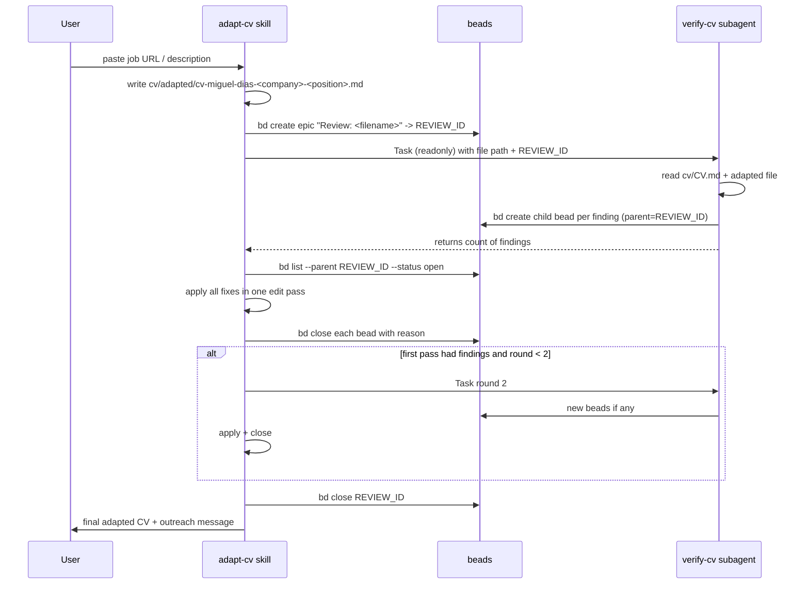

## Orchestration flow



## Ground truth and flagging rules

Source of truth: [cv/CV.md](cv/CV.md). (`Resume.md` is a subset, also truthful.)

Flag as `fabrication` (P1):
- Tools, companies, clients, certifications, durations, or numeric claims that appear nowhere in `cv/CV.md`.
- Achievements/outcomes not traceable to any bullet in `cv/CV.md`.

Flag as `overstated-scope` (P2):
- Verbs that inflate ownership: "led/owned/architected" when `cv/CV.md` says "contributed to / helped / participated".
- Team-size or blast-radius inflation.
- Broadening tech a claim applies to (e.g. "across AWS, GCP, Azure" when `cv/CV.md` only mentions AWS).

Not flagged: creative phrasing that preserves meaning, reordering, emphasis changes, translation.

## New skill: `.cursor/skills/verify-cv/SKILL.md`

Frontmatter:

```markdown
---
name: verify-cv
description: Fact-checks an adapted CV against cv/CV.md and logs each fabrication or overstated-scope issue as a bead under a review epic. Do not invoke directly; adapt-cv invokes this as a readonly subagent.
---
```

Body (condensed):

1. Inputs (from invoker context): `ADAPTED_PATH` (e.g. `cv/adapted/cv-miguel-dias-amazon-sde.md`), `REVIEW_ID` (parent epic bead ID).
2. Read `cv/CV.md` fully. Read `ADAPTED_PATH` fully.
3. For every claim in the adapted CV that carries factual weight (tool, company, outcome, metric, scope verb), decide supported / overstated / fabricated per rules above.
4. For each non-supported claim, create one bead:
   ```
   bd create "<short label>" -t bug -p <1|2> --parent $REVIEW_ID \
     -d "Quote: \"<offending sentence>\"\nIssue: <fabrication|overstated-scope>\nEvidence: <cv/CV.md excerpt or 'absent'>\nSuggested fix: <rewrite or 'remove sentence'>"
   ```
5. Return a one-line summary: `Findings: N fabrications, M overstated`. Do not modify any file.

This skill only runs inside a readonly Task subagent so it cannot mutate the adapted CV directly — the only side effect is beads.

## Changes to `.cursor/skills/adapt-cv/SKILL.md`

Add a new section **after** the existing adaptation/message instructions, before the final sections:

```markdown
## Fact-check loop

After writing the adapted CV (and before presenting to the user), run this loop:

1. Create a review epic:
   `REVIEW_ID=$(bd create "Review: <adapted-filename>" -t epic -p 1 --silent)`
2. Spawn a readonly subagent with `subagent_type=generalPurpose` (or a dedicated one), passing:
   - the path to the adapted CV
   - `REVIEW_ID`
   - instructions: "Read and follow `.cursor/skills/verify-cv/SKILL.md`. Report back only the finding count."
3. `bd list --json` filtered to `parent == REVIEW_ID` and `status == open`. If zero, close the epic and skip to step 6.
4. Apply every finding in a single edit pass on the adapted CV, using each bead's "Suggested fix". Close each bead with `bd close <id> --reason "applied"`.
5. If this was round 1, repeat steps 2-4 once (round 2 cap). If round 2 still produces beads, leave them open and tell the user which beads need human judgement instead of looping further.
6. `bd close $REVIEW_ID --reason "review complete"`.
7. Present the adapted CV path and the outreach message to the user.
```

Also tighten the existing adaptation rules with one new line: "Every factual claim must be traceable to `cv/CV.md`. If you can't find support, drop the claim or soften it to a paraphrase of what `cv/CV.md` actually says."

## Beads usage summary

- One epic per adaptation: `Review: cv-miguel-dias-<company>-<position>.md`, type `epic`, P1.
- One child bead per finding, type `bug`, P1 (fabrication) or P2 (overstated-scope), parent=epic.
- No cross-adaptation bead coupling; epics are independent and short-lived.
- Beads survive compaction, so if the loop is interrupted the next session can resume with `bd list --status open` and pick up unapplied findings.

## Interaction with the `cv/` reorg epic (`CV-wwm`)

This work depends on the reorg landing first (paths `cv/CV.md`, `cv/adapted/...` must exist). Track as:
- New epic `Fact-check loop for adapted CVs` with 2 children: "Create verify-cv skill" and "Extend adapt-cv with loop orchestration".
- Both blocked by `CV-wwm.7` (adapt-cv skill update) so they edit the reorganised skill, not the old one.

## Open risks / non-goals

- The verifier can miss subtle embellishments — two-round cap intentionally stops infinite polishing; remaining issues are surfaced as open beads for you to review.
- Outreach message is not saved to disk (earlier decision) so it is not fact-checked by this loop; if you want it checked too, that's a small extension (reviewer reads the message from the chat transcript won't work — we'd need to stash it in a scratch file first).
- `bd dolt push` will still fail in sandboxed runs with no GitHub access; beads stay local until pushed manually.
